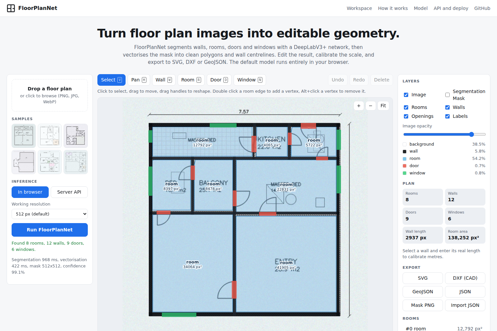
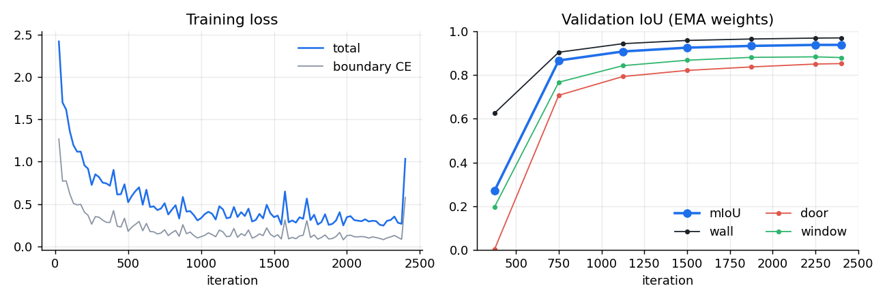
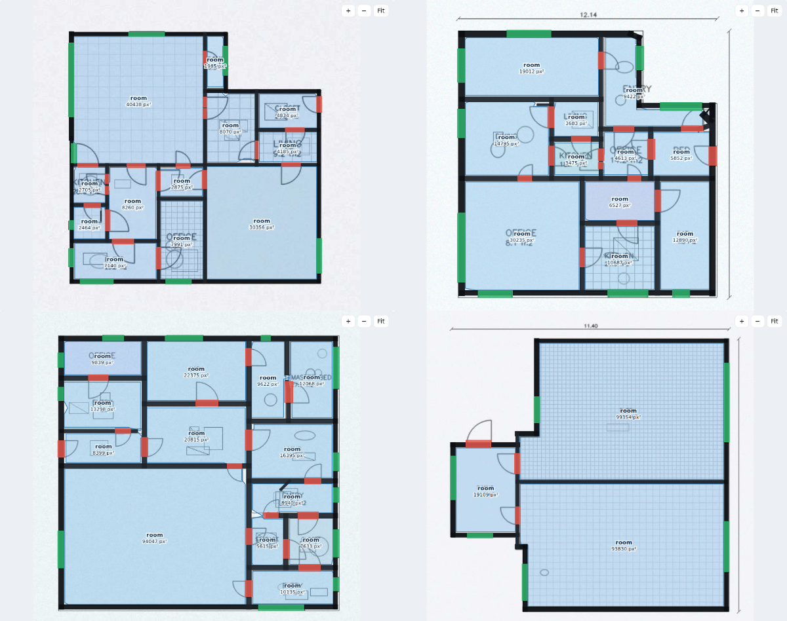

# FloorPlanNet

**Architectural floor plan parsing with DeepLabV3 and contour-based vectorisation.**
Segment walls, rooms, doors and windows in raster floor plans, turn the masks into clean, editable geometry, and export it to SVG, DXF or GeoJSON.

[](https://github.com/OWNER/floorplannet/actions/workflows/ci.yml)
   



| | |
|---|---|
| **Segmentation** | DeepLabV3 (ResNet-50/101, torchvision) and DeepLabV3+ (any `timm` encoder, or MobileNetV3 for the browser) |
| **Data** | CubiCasa5K loader with an SVG rasteriser (5,000 plans, 4,200 / 400 / 400 split), plus a procedural plan generator |
| **Training** | AMP, EMA, poly LR with warmup, grad accumulation, DDP via `torchrun`, boundary-weighted CE + soft Dice |
| **Evaluation** | Streaming confusion matrix: mIoU, fwIoU, pixel and mean accuracy, per-class IoU; sliding-window inference with Gaussian blending and D4 TTA |
| **Vectorisation** | Skeleton graph walls, Douglas-Peucker, Manhattan snapping, collinear merging, T/L junction closure, rectified room polygons, oriented door/window rectangles bound to host walls |
| **Serving** | ONNX export with parity check, optional INT8, FastAPI service in a torch-free Docker image |
| **Web app** | Next.js on Vercel. The model runs in the browser through onnxruntime-web; a TypeScript port of the vectoriser produces geometry you can edit and export |

---

## Contents

1. [Quick start](#quick-start)
2. [Results](#results)
3. [How it works](#how-it-works)
4. [Training on CubiCasa5K](#training-on-cubicasa5k)
5. [Inference API](#inference-api)
6. [Deploy](#deploy)
7. [Repository layout](#repository-layout)
8. [Limitations](#limitations)

## Quick start

```bash
git clone https://github.com/OWNER/floorplannet && cd floorplannet

# Web app (browser inference, no backend needed)
cd web && npm install && npm run dev          # http://localhost:3000

# Python package
pip install torch torchvision --index-url https://download.pytorch.org/whl/cpu   # or your CUDA build
pip install -r requirements-dev.txt && pip install -e .
pytest                                                                          # Python test suite

# Parse a plan from the command line
floorplannet predict plan.png --ckpt models/floorplannet_lite.onnx --out out/ --svg --dxf --geojson
```

`predict` writes the class mask, a colour overlay, geometry JSON and whichever vector formats you ask for.

## Results

<!-- RESULTS:START -->
### Browser model (shipped in `web/public/models`)

DeepLabV3+ with a dilated MobileNetV3-Large encoder (4.03 M parameters), trained from scratch for 2,400 iterations on 3,000 procedurally generated plans (about 70 minutes on a 2-core CPU), evaluated on 200 held-out generated plans. The shipped file is the INT8 static-quantised export (4.2 MB); FP32 is 14.7 MB.

| Pixel metrics | FP32 | INT8 (shipped) |
|---|---|---|
| **mIoU** | **0.939** | **0.938** |
| pixel accuracy | 0.995 | 0.995 |
| IoU background / wall / room | 0.996 / 0.971 / 0.993 | 0.996 / 0.969 / 0.993 |
| IoU door / window | 0.853 / 0.881 | 0.851 / 0.880 |

| Vector output (`scripts/eval_vectorization.py`, INT8) | |
|---|---|
| room detection F1 (polygon IoU >= 0.5) | 0.987 (P 0.981, R 0.992) |
| mean IoU of matched room polygons | 0.975 |
| plans with exactly the right room count | 89.5% |
| door detection F1 | 0.985 |
| window detection F1 | 0.994 |

Latency at 512 px on 2 vCPU: about 0.45 s segmentation (onnxruntime-web WASM, warm) plus 0.3 to 0.45 s vectorisation in the browser; about 0.35 s for segmentation through the API.



These are synthetic-domain numbers. They show the pipeline works end to end; they are not a CubiCasa5K result.


<!-- RESULTS:END -->

### CubiCasa5K benchmark

The configs in `configs/` reproduce the main experiment. Numbers are written by `floorplannet evaluate`; nothing in this table is copied from elsewhere.

| Config | Backbone | Taxonomy | Crop | Test mIoU | Target |
|---|---|---|---|---|---|
| `cubicasa5k_deeplabv3_r101.yaml` | ResNet-101, OS 8 | coarse (5) | 512 | run `make train eval` | 0.83 |
| `cubicasa5k_deeplabv3plus_r50.yaml` | ResNet-50, OS 16, stride-4 decoder | coarse (5) | 512 | run it | 0.83 |
| `cubicasa5k_rooms12.yaml` | ResNet-101, OS 8 | CubiCasa 12 rooms + openings | 512 | run it | |

Coarse taxonomy: `background, wall, room, door, window`. The 12-class taxonomy groups room types the way the official CubiCasa5K code does (see `floorplannet/classes.py`), so it can be compared with the paper after you confirm the mapping matches your checkout.

## How it works

```
 raster plan ─► DeepLabV3(+) ─► 5-class mask ─► cleanup ─┬─► walls    skeleton ─► graph ─► Douglas-Peucker ─► snap ─► merge ─► junctions
                 ASPP + decoder   argmax + conf  speckle   ├─► rooms    components ─► contours ─► DP ─► orthogonalise
                                                 refill    └─► openings components ─► min-area rect ─► host wall
                                                                           │
                                                           editable geometry (JSON) ─► SVG / DXF / GeoJSON
```

### Segmentation

* **DeepLabV3** uses a dilated ResNet (output stride 8) and ASPP with rates 12/24/36. The auxiliary FCN head on layer 3 is trained with weight 0.4.
* **DeepLabV3+** adds a decoder that fuses stride-4 features, which matters here: walls are often 3 to 8 px wide and openings are small.
* **Loss** is cross-entropy with a boundary weight map (pixels within 2 px of a label edge get 3x weight) plus soft Dice over present classes. Thin, rare classes (doors, windows) are what break vectorisation, so the loss is built to care about them.
* **Augmentation** uses the D4 symmetry group of floor plans (90 degree rotations and flips are label-preserving), scale jitter, foreground-biased crops, photometric jitter, blur and noise. Masks are always resampled with nearest neighbour.
* **Inference** tiles large plans with 25% overlap and blends tiles with a Gaussian window, which removes seam artefacts that would otherwise cut walls at tile borders. Optional TTA averages flips and a rotation.

### Vectorisation

Every tolerance is a multiple of the median wall thickness `t`, estimated from the distance transform sampled on the skeleton. This makes one config work for thumbnails and 4000 px scans.

1. **Cleanup.** Components smaller than 12 px are removed and refilled from the nearest surviving label (distance-transform indices).
2. **Walls.** The structural mask (wall, door and window) is closed, thinned, and decomposed into a pixel graph where nodes are pixels of degree other than 2. Redundant diagonal neighbours are ignored so junction degrees are correct. Spurs shorter than `1.5t` are pruned. Each branch is simplified with Douglas-Peucker (`0.35t`), segments within 12 degrees of an axis are snapped, collinear segments within `0.9t` are merged across gaps up to `1.2t`, and endpoints within `1.6t` of a perpendicular wall are extended or trimmed onto it. Thickness is the median of `2 x distance` along each segment. Walls are flagged exterior when samples on either side hit background.
3. **Rooms.** Connected room regions (4-connectivity, so walls and door gaps separate rooms) are traced, simplified, and orthogonalised: consecutive collinear axis edges are merged and each vertex is rebuilt from the fixed coordinates of its two adjacent edges.
4. **Openings.** Door and window components become minimum-area rectangles, snapped to 0 or 90 degrees, and attached to the nearest wall.

The browser version (`web/lib/vectorize.ts`) is a port of `floorplannet/vectorize/vectorizer.py` with its own exact EDT, Zhang-Suen thinning, Moore contour tracing and rotating-calipers rectangles. `web/tests/vectorize.test.ts` checks that both implementations agree on room, door and window counts and on total area.

## Training on CubiCasa5K

```bash
make data                          # download (about 5.3 GB) and rasterise masks
python scripts/prepare_cubicasa.py # prints class frequencies and suggested class weights
make train                         # DeepLabV3 R101, AMP, EMA
make eval                          # test split with TTA -> prints mIoU and per-class IoU
make export                        # ONNX with dynamic H/W and a parity check
```

Multi-GPU: `torchrun --nproc_per_node 4 -m floorplannet.cli train -c configs/cubicasa5k_deeplabv3_r101.yaml`.
Any config key can be overridden from the command line, for example `optim.lr=3e-4 data.crop_size=640`.

The loader reads `F1_scaled.png` and `model.svg` from each plan folder. SVG groups are classified by their `class` attribute (`Wall`, `Door`, `Window`, `Space <Type>`, `Railing`), transforms are composed down the tree, and polygons are painted in z-order rooms, walls, windows, doors. Masks are cached next to each plan.

A training image is also provided: `docker build -f Dockerfile.train -t floorplannet-train .`

### The browser model

`configs/synthetic_lite.yaml` trains DeepLabV3+ with a MobileNetV3-Large encoder from scratch on procedurally generated plans. It is small enough to run on a CPU in about an hour and in a browser in well under a second per plan.

```bash
python scripts/make_synthetic.py --out data/synthetic --train 3000 --val 200
floorplannet train -c configs/synthetic_lite.yaml
python scripts/export_web_model.py --ckpt runs/synthetic_lite/best.pt --int8   # keeps INT8 only if mIoU drops < 1 point
python scripts/eval_vectorization.py --model models/floorplannet_lite.onnx      # room / door / window F1
```

To adapt it to real drawings, fine-tune from that checkpoint with `configs/cubicasa5k_finetune_lite.yaml` and export again.

## Inference API

```bash
docker compose up --build api          # http://localhost:8000/docs
```

| Method | Path | Body | Returns |
|---|---|---|---|
| GET | `/health` | | model name, classes |
| POST | `/api/predict` | multipart `file`, optional `tta`, `max_side`, `px_per_meter` | geometry, summary, base64 mask, timings |
| POST | `/api/vectorize` | multipart `file` (class-index PNG) | geometry |
| POST | `/api/export/{svg,dxf,geojson,json}` | geometry JSON | file |

```bash
curl -F file=@plan.png -F tta=true localhost:8000/api/predict | jq .summary
```

The API image contains ONNX Runtime and OpenCV only (no PyTorch). Point `FLOORPLANNET_MODEL` at any exported model, for example the ResNet-101 one.

## Deploy

### Web app on Vercel

1. Push this repository to GitHub.
2. In Vercel, **Add New Project**, import the repo, and set **Root Directory** to `web`. The framework is detected as Next.js.
3. Optional environment variables: `NEXT_PUBLIC_API_URL` (your API), `NEXT_PUBLIC_MODEL_URL` (host weights elsewhere), `NEXT_PUBLIC_REPO_URL`.
4. Deploy. `npm install` copies the onnxruntime-web WASM files into `public/ort`, and `next.config.mjs` sets cross-origin isolation headers so inference can use WASM threads.

Or from a terminal: `cd web && npx vercel --prod`.

Any other static host works too: `make standalone` writes `web/dist-standalone/` (plain HTML, JS, WASM and the model, all with relative paths). Without the cross-origin isolation headers inference runs single-threaded, which is still under a second per plan.

### API

The API is a standard container listening on `$PORT`, so it runs on Render, Railway, Fly.io, Google Cloud Run or a Hugging Face Docker Space without changes. Set `ALLOWED_ORIGINS` to your Vercel domain.

## Repository layout

```
floorplannet/
  classes.py            taxonomies and CubiCasa room mapping
  config.py             typed YAML config with CLI overrides
  data/                 CubiCasa5K SVG loader, synthetic generator, augmentations, datasets
  models/deeplab.py     DeepLabV3 / DeepLabV3+ model zoo
  losses.py metrics.py  boundary-weighted CE + Dice, confusion-matrix metrics
  engine/trainer.py     AMP, EMA, DDP, checkpointing
  inference/            tiled predictor (torch or ONNX), ONNX export and INT8
  vectorize/            raster-to-vector pipeline and exporters (JSON, GeoJSON, SVG, DXF)
  cli.py                train / evaluate / predict / export / vectorize
serve/                  FastAPI app and Dockerfile
configs/                experiment configs
scripts/                dataset download, synthetic rendering, web export
tests/                  pytest suite (data, model, metrics, vectoriser, API)
web/                    Next.js app: in-browser inference, vector editor, exporters, vitest suite
```

## Limitations

* The browser model is trained on synthetic plans. It handles clean, CAD-style drawings well; scans, hand sketches and heavily furnished plans need the CubiCasa5K models.
* Wall vectorisation assumes mostly rectilinear architecture. Oblique walls are kept but not snapped; curved walls become polylines.
* Areas are in pixels until you calibrate the scale (select a wall in the web app and type its real length, or pass `--px-per-meter`).
* CubiCasa5K is licensed CC BY-NC 4.0, so models trained on it inherit a non-commercial restriction. The code here is MIT.

## Citation

If you use the CubiCasa5K data, cite: Kalervo, Ylioinas, Häikiö, Karhu, Kannala. *CubiCasa5K: A Dataset and an Improved Multi-Task Model for Floorplan Image Analysis.* SCIA 2019.
